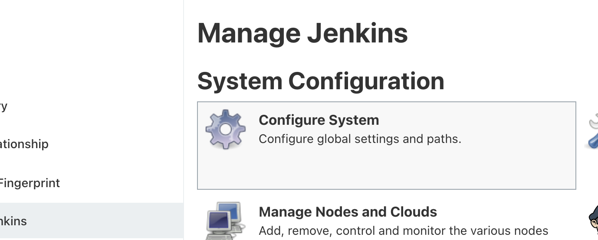
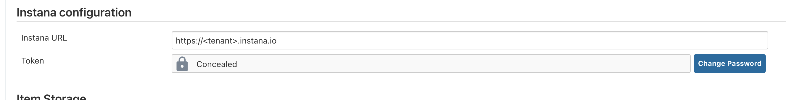
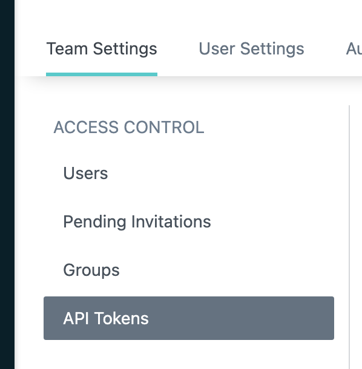
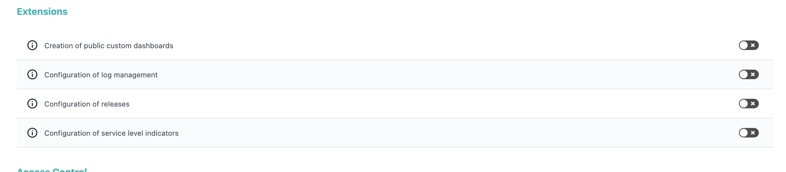

# Instana Pipeline Feedback Integration for Jenkins

This plugin provides you with the possibility to inject Release Markers into Instana


## Features

The following features are available in both Pipeline and traditional
project types:

* Injecting Release Markers into Instana 

### Pipeline features
To ingest a Release Marker into Instana you simply need to add 
`releaseMarker` to your Pipeline script .

There is one mandatory parameter `releaseName` and two optional parameters `services` and `applications`.

For example
```groovy
releaseMarker releaseName: "Release 4711"
```
or 
```groovy
releaseMarker releaseName: "Test Release ${currentBuild.number}"
```

If you wish to create a release for a particular timestamp you can use the optional `releaseStartTimestamp`

```groovy
releaseMarker releaseName: "Test Release ${currentBuild.number}", releaseStartTimestamp: "1564486446000"
```

To create a release scoped to a given service or application you can add the `services` or `applications` as parameter

```groovy
// service scoped, single service
releaseMarker releaseName: "Release 4711", services: [service(name: "my-service")]

// service scoped, multiple services
releaseMarker releaseName: "Release 4711", services: [service(name: "my-service-1"), service(name: "my-service-2")]
```

```groovy
// application scoped, single application
releaseMarker releaseName: "Release 4711", applications: [application (name: "My Application")]

// application scoped, multiple applications
releaseMarker releaseName: "Release 4711", applications: [application (name: "My Application-1"), application (name: "My Application-2")]
```

## Installation

The Instana Integration plugin can be installed right from the Plugin Manager in Jenkins. Following the Jenkins restart, the Instana plugin must be configured to know which tenant and api-key must be used.

To configure the Instana Integration open up _Manage Jenkins_ and select _Configure System_.



In the settings screen, scroll down to the section called _Instana configuration_. The field named _Instana URL_ must be set to your tenant's Instana URL in the format of _https://<tenant>.instana.io_.



For _Token_ an Instana API Token needs to be created. A token can be created from the Instana UI under _Settings_ / _API Tokens_.



Select _Add API Token_ and make sure that _Extensions_ / _Configuration of releases_ is enabled. Copy the generated API Token and pass it to the Jenkins Instana configuration using the _Change Password_ button. Don't forget to save the configuration.
  

